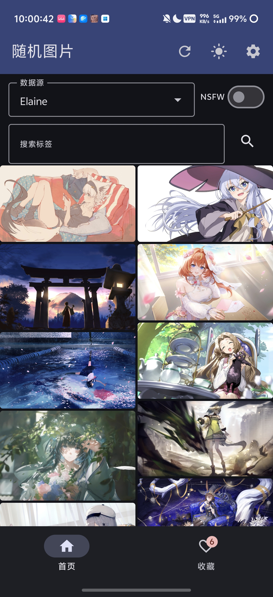
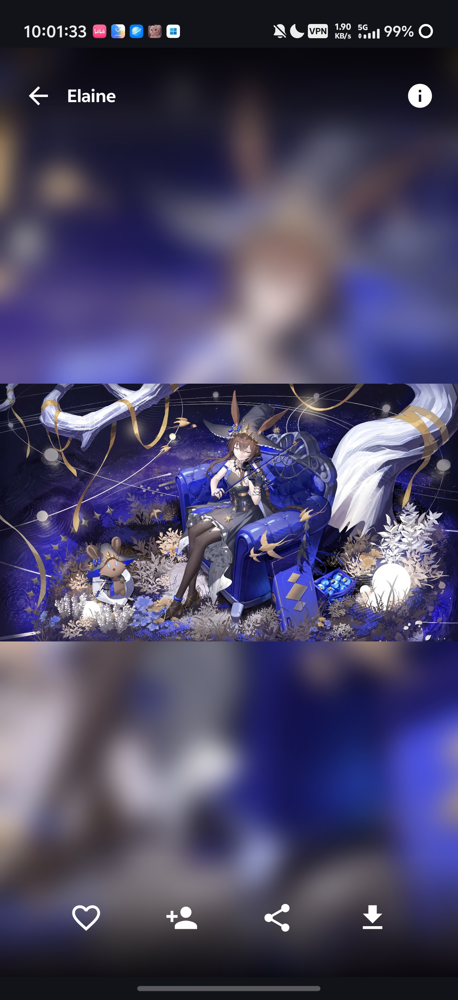
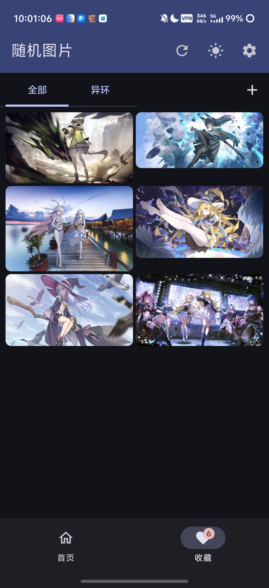
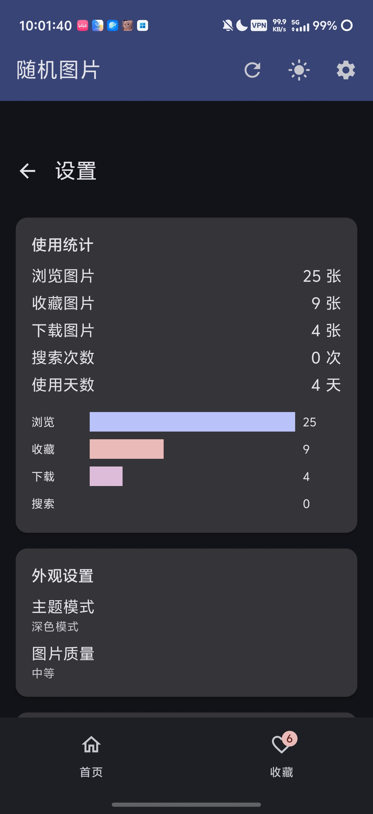
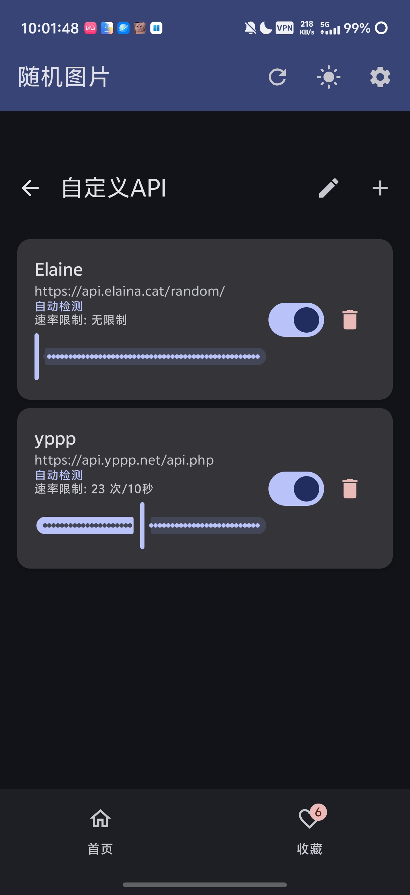

# 随机图片 App

一款支持自定义API源的随机图片浏览应用，主打二次元内容，支持瀑布流浏览、收藏管理、预测性返回动画等功能。

## 截图预览

| 首页瀑布流 | 图片详情 | 收藏页面 |
|:---:|:---:|:---:|
|  |  |  |

| 设置页面 | 自定义API |
|:---:|:---:|
|  |  |

## 功能特性

### 自定义 API 数据源
- **自定义API** - 支持添加任意 Lolicon 兼容或直连图片 API
- **推荐API** - 内置6个推荐API一键添加（Lolicon、Elaina、TheCatAPI、TheDogAPI、Picsum、随机壁纸）
- **API类型** - 自动检测 / Lolicon格式 / 直连图片
- **速率限制** - 每个API可单独设置请求频率限制

### 核心功能

- **瀑布流布局** - 非对称瀑布流，无限滚动
- **图片搜索** - 支持标签搜索
- **NSFW 切换** - 一键切换成人内容
- **图片详情** - 全屏查看，支持双击缩放、左右滑动切换

### 收藏功能

- **收藏图片** - 点击爱心图标收藏
- **收藏分组** - 支持创建分组管理
- **批量操作** - 批量选择、删除、移动分组
- **收藏排序** - 按时间/名称排序

### 图片操作

- **下载** - 保存到本地相册
- **分享** - 分享到微信/QQ
- **设为壁纸** - 设置为手机壁纸
- **信息面板** - 查看画师、标签、分辨率等元数据

### 设置功能

- **主题切换** - 浅色/深色/跟随系统
- **莫奈取色** - Android 12+ 动态颜色
- **预测性返回** - Android 16 预测性返回动画开关
- **图片质量** - 缩略图/中等/原图
- **缓存管理** - 缓存预览、清除缓存
- **云同步** - WebDAV 备份恢复

### 其他功能

- **回忆卡片** - 首页显示历史浏览的回忆图片
- **标签云** - 自动记录浏览标签
- **画师关注** - 关注喜欢的画师
- **使用统计** - 浏览/收藏/下载/搜索次数

## 技术栈

- **语言**: Kotlin
- **UI**: Jetpack Compose + Material3
- **架构**: MVVM + Clean Architecture
- **依赖注入**: Hilt
- **本地存储**: DataStore + Moshi JSON
- **图片加载**: Coil
- **网络请求**: OkHttp

## 安装使用

1. 从 [Releases](https://github.com/lingyuan0914/random-image-app/releases) 下载最新 APK
2. 安装到 Android 设备（需要 Android 8.0+）
3. 打开应用，添加 API 源开始浏览

## 开发环境

- Android Studio Hedgehog+
- JDK 17
- Android SDK 36
- Gradle 8.5

## 构建

```bash
# 设置环境变量
export JAVA_HOME=/path/to/jdk-17
export ANDROID_HOME=/path/to/android-sdk

# 构建 Debug APK
./gradlew assembleDebug

# 构建 Release APK
./gradlew assembleRelease
```

## 权限说明

| 权限 | 用途 |
|------|------|
| `INTERNET` | 网络请求 |
| `WRITE_EXTERNAL_STORAGE` | 保存图片（Android 9 及以下） |
| `SET_WALLPAPER` | 设置壁纸 |

## 许可证

MIT License

## 联系方式

- GitHub: [@lingyuan0914](https://github.com/lingyuan0914)
